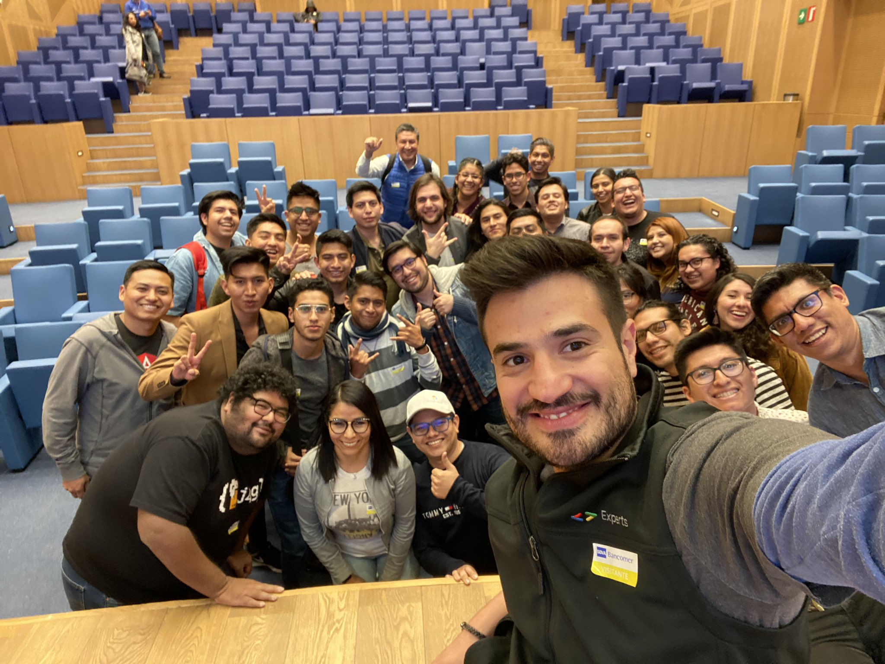
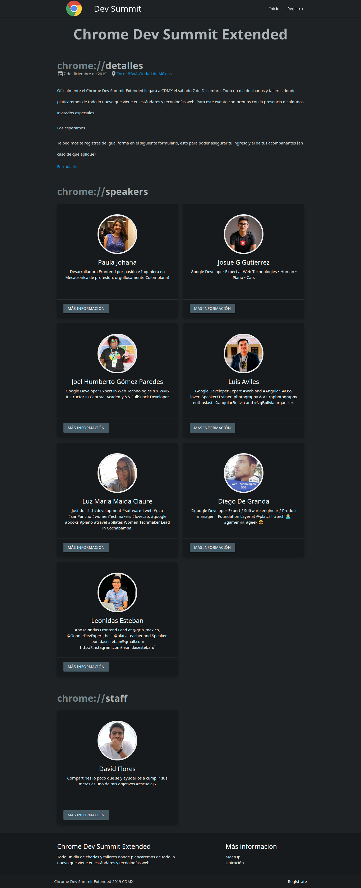
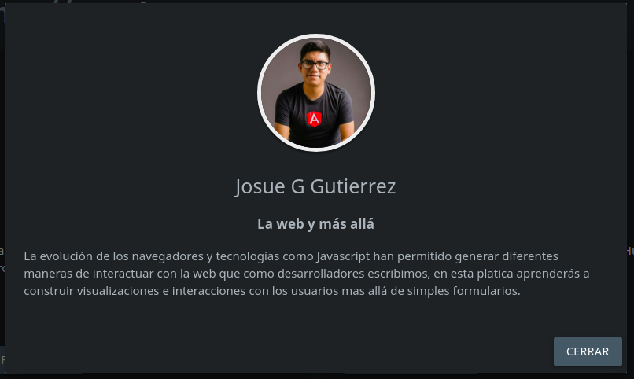
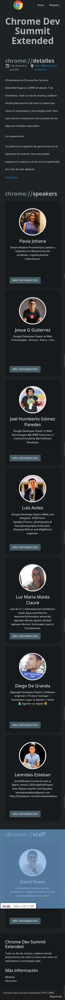

# :space_invader: Chrome Dev Summit Extended :space_invader:

Landing page about the meetup

- **Organizer:** [Diego De Granda](https://twitter.com/degranda10)
- **Place:** CDMX, México
- **Speakers**:
  - [Paula Johana](https://twitter.com/paulasaguz)
  - [Josue G Gutierrez](https://twitter.com/eusoj)
  - [Joel Humberto Gómez Paredes](https://twitter.com/DezkaReid)
  - [Luis Aviles](https://twitter.com/luixaviles)
  - [Luz Maria Maida Claure](https://twitter.com/LuMaidacl)
  - [Diego De Granda](https://twitter.com/degranda10)
  - [Leonidas Esteban](https://twitter.com/LeonidasEsteban)

### You can view [Live demo](https://chromedev.dflores.dev/)

### Amazing people

## Wireframes

### 1. Desktop

### 2. Card

### 3. Mobile

## Follow me [dflores.dev](https://dflores.dev/)

### Anywhere @dfloresdev

You can contribute on [this link](https://github.com/dfloresdev/chromeDevSummitExtended)
